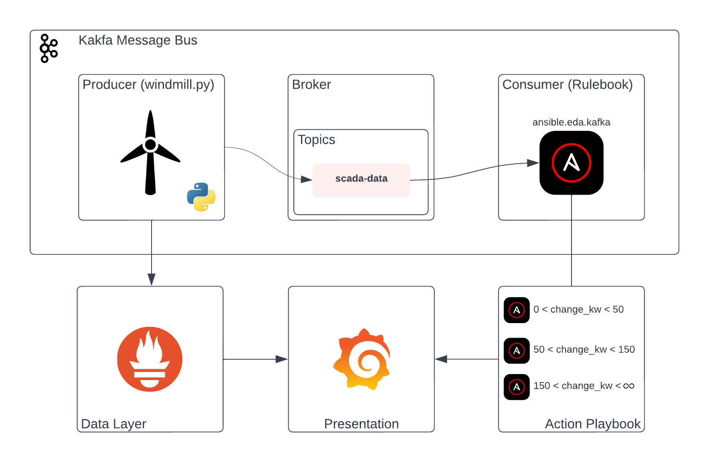

# ansible-event-driven

Event Driven Ansible (EDA) example workflows (sources, rulebooks, playbooks)

## scada-demo



### Prerequisites

- Install Kafka using the [quickstart docs](https://kafka.apache.org/quickstart)
- Unzip the [kaggle dataset](./datasets/wind_turbine.zip) to `/datasets/raw/wind_turbine`
- Create an inventory with your grafana information
  ```yaml
  all:
  children:
    ungrouped:
      hosts:
        localhost:
          ansible_connection: local
          grafana_admin_api_key: <token>
          grafana_eda_dashboard_uid: <guid>
  ```

### Initialize Kafka Environment
1. Start Zookeeper server<br>
   `bin/zookeeper-server-start.sh config/zookeeper.properties`
1. Start Kafka Broker<br>
   `bin/kafka-server-start.sh config/server.properties`
1. Create topic for demo<br>
   `bin/kafka-topics.sh --create --topic scada-data --bootstrap-server localhost:9092`
1. Start CLI consumer for inspection (OPTIONAL)<br>
   `bin/kafka-console-consumer.sh --topic scada-data --bootstrap-server localhost:9092`

### Start Event-Driven Ansible

`ansible-rulebook -r scada_rulebook.yml -i inventory.yml -v`